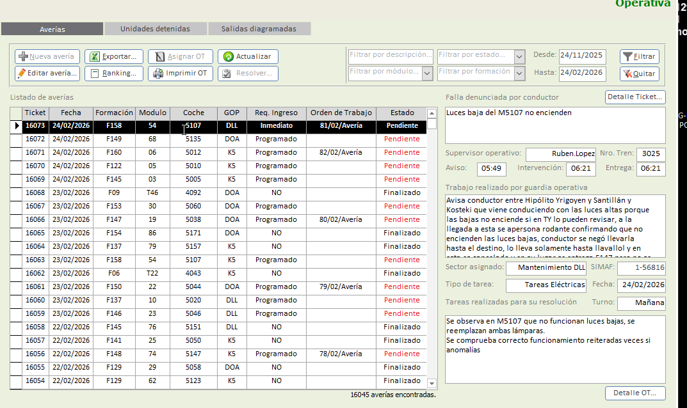

## 🚀 2 - Refactor del prototipo ya creado (prompt para IA)

### Objetivo

Refactorizar el prototipo existente para mejorar la mantenibilidad, la escalabilidad y la adherencia a la arquitectura limpia. Esto incluye:

El proposito del sistema de tickets va a ser generar tickets de averías sobre el material rodante diésel, vamos a tener 1 menú de ingreso que va a optar por Locomotoras o Coches Remolcados.
Vamos a crear un crud de Tickets (Averías) tratando de reproducir la imagen adjunta 

no en su formato si no en su información. Generando la siguiente estructura de tablas.
Vamos a tener una tabla de unidades de mantenimiento, tomando las entidades similar a ARS_MP, la unidad de mantenimiento puede ser una locomotora, o un coche remolcado que es a quien se le va a cargar el ticket (avería)
Las locomotoras y coches tienen distintos atributos, por eso, usamos Unidad de mantenimiento tomado de ARS_MP, hijas Locomotoras pueden ser Marca Dalian CNR, Modelos 8G u 8H, o marca General Motors (GM), modelos, G12, GR12, G22-CW, G22-CU, GT22-CW, GT22-CW-2, GT22-CU.
Coches Remolcados: Marca Materfer, Clases: U (Única), FU (Furgón Única), F (Furgón)
Marca CNR: Clase, CPA (Coche de Primera con Aire Acondicionado), CRA (Coche Restaurant con AA), PUA (Coche Pullman con AA), PUAD (Coche Pullman con AA p/Discapacitados), FS (Coche Furgón de Servicio), FG (Coche Furgón Generador). Creemos las entidades. Después vamos a necesitar la tabla de Tickets con Nro de Ticket, Fecha, Unidad de Mantenimiento (loc o CCRR), GOP (Guardia Operativa que interviene), Un campo "Ingreso", con 3 valores posibles: "Inmediato", "Programado", "NO", Campo Nro OT si existiera, Campo Estado ("Pendiente", "Finalizado"). Supervisor interviniente, Nro de Tren, y 3 campos para horas: Aviso, Intervención y Entrega (puede que no se halla intervenido por lo que éstas pueden estar vacías). Campos de escritura libre "Falla denunciada por conductor", "Observaciones / Trabajo realizado por GOP". 

Hay campos que al cargar el formulario ya tienen que tener valor predeterminado, que se obtendrán desde la base de datos que solo vamos a poder cargar los Admins.
	Unidades de Mantenimiento
	Marcas
	Clases
	modelos
	GOP (Guardias operativas)
	Supervisores
	Nro de Tren
	Tipo de falla: 
		Mecánicas
		Eléctricas
		Neumáticas
		Electrónicas
		Otras
		ATS
		Hombre Vivo (HV)
		Hasler

	Y dejarlo preparado para poder extender en cada tipo de falla unas "Fallas agrupadas", por ejemplo:
					Mecánicas: -> Motor Diésel
					Eléctricas: -> Motor de tracción
					etc.

